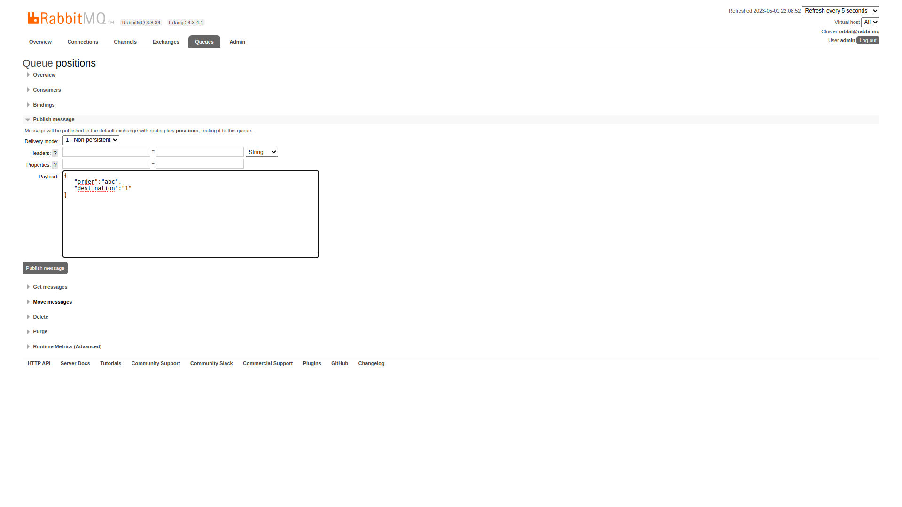
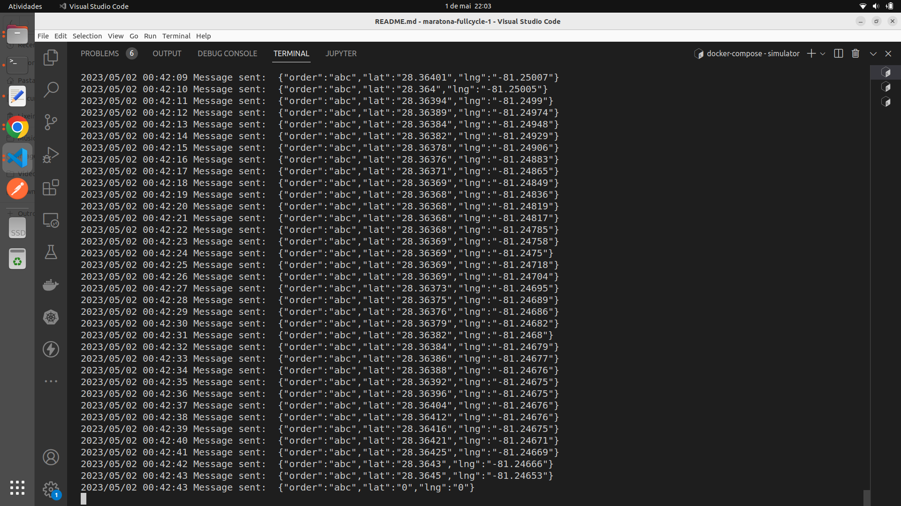
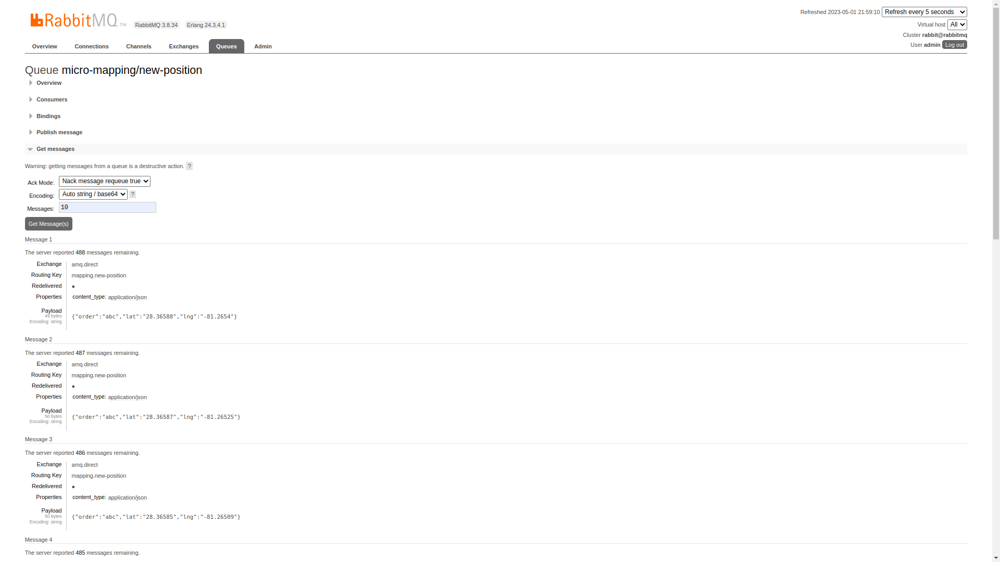

# Maratona Full Cycle - Codelivery - Part I

O projeto consiste em:

- Um sistema de monitoramento de veículos de entrega em tempo real.

Requisitos:

- Uma transportadora quer fazer o agendamento de suas entregas;
- Ela também quer ter o _feedback_ instantâneo de quando a entrega é realizada;
- Caso haja necessidade de acompanhar a entrega com mais detalhes, o sistema deverá informar, em tempo real, a localização do motorista no mapa.

#### Que problemas de negócio o projeto poderia resolver?

- O projeto pode ser adaptado para casos de uso onde é necessário rastrear e monitorar carros, caminhões, frotas e remessas em tempo real, como na logística e na indústria automotiva.

Dinâmica do sistema:

1. A aplicação _Order_ (_React_/_Nest.js_) é responsável pelas ordens de serviço (ou pedidos) e vai conter a tela de agendamento de pedidos de entrega. A criação de uma nova ordem de serviço começa o processo para que o motorista entregue a mercadoria;

2. A aplicação _Driver_ (_Go_) é responsável por gerenciar o contexto limitado de motoristas. Neste caso, sua responsabilidade consiste em disponibilizar os _endpoints_ de consulta;

3. Para a criação de uma nova ordem de serviço, a aplicação _Order_ obtém de _Driver_ os dados dos motoristas. Neste caso, _REST_ é uma opção pertinente, porque a comunicação deve ser a mais simples possível. Então, ela acontece de forma direta (síncrona) com uma requisição _HTTP_;

4. Após criar a nova ordem de serviço, _Order_ notifica a aplicação _Mapping_ (_Nest.js_/_React_) via _RabbitMQ_ de que o motorista deve iniciar a entrega. _Mapping_ é a aplicação que vai exibir no mapa a posição do motorista em tempo real. A aplicação _Simulator_ (_Go_) também é notificada sobre o início da entrega e começa a enviar para a aplicação _Mapping_ as posições do veículo;

5. Ao finalizar a entrega, a aplicação _Mapping_ notifica via _RabbitMQ_ a aplicação _Order_ de que o produto foi entregue e a aplicação altera o _status_ da entrega de Pendente para Entregue.

## Tecnologias

#### Operate What You Build

- Nesta versão inicial, trabalhamos apenas com o _backend_. Posteriormente, serão adicionadas as tecnologias de _frontend_, integração contínua, _deploy_ e observabilidade.

  - Backend

    - Golang
    - RabbitMQ

## Formatos de Comunicação

- _REST_
- Sistema de mensageria (_RabbitMQ_)

  ### Comunicação entre Serviços

  - _REST_ é um dos formatos de comunicação mais conhecidos, principalmente pelo uso em cenários aonde o cliente da requisição é o _browser_. No entanto, há situações em que o formato de comunicação entre serviços precisa ser outro. Por exemplo, quando há a necessidade da garantia de entrega das mensagens. Neste caso, um sistema de mensageria é uma opção bastante pertinente.

  - Quais são alguns dos sistemas de mensageria comuns no mercado?

    - RabbitMQ;
    - Apache Kafka (Sistema de Stream);
    - Amazon SQS;
    - ActiveMQ;
    - Redis.

  ### RabbitMQ

  - _RabbitMQ_ é um dos sistemas de mensageria mais tradicionais; é simples, funciona muito bem e vem sendo utilizado por sistemas gigantes. Costuma-se dizer que é como o _HTML_ dos sistemas de fila, porque todo programador deveria conhecer, independente de ser a opção adotada na empresa.

  - Funcionamento Básico

    - O _RabbitMQ_ trabalha com um _Publisher_ e um _Consumer_;
    - O _Publisher_ publica uma mensagem para ser consumida pelo _Consumer_;
    - A mensagem é publicada para uma fila, só que não é enviada diretamente para a fila - ela é enviada para uma _Exchange_;
    - E o que faz a _Exchange_? A _Exchange_ contém regras e, baseado nessas regras, as mensagens são encaminhadas para as filas que foram configuradas.

  - Principais Tipos de _Exchange_

    - _Direct_: Com uma configuração, é possível escolher as filas para onde as mensagens vão cair;
    - _Fanout_: Todas as filas concentradas nessa _Exchange_ vão receber a mensagem. A _Exchange_ manda para todas as filas;
    - _Topic_: É uma _Exchange_ similar à _Direct_, mas é mais flexível de configurar para qual fila enviar as mensagens.

  - Direct Exchange

    - O uso desse tipo de _Exchange_ é bastante comum, sendo também a _Exchange_ mais utilizada neste projeto.
    - Qual é a idéia principal?
      - A partir de um _Publisher_ (ou _Producer_), há vários _Consumers_ que podem estar interessados em receber uma mensagem. Mas, cada _Consumer_ vai consumir apenas a mensagem que fizer mais sentido para ele. Ou seja, ele fica escutando filas específicas. No entanto, não se trata de um _Fanout_: ao enviar a mensagem para a _Exchange_, não se replica para todas as filas; trabalha-se a partir de uma regra. Essa regra vai permitir que a mensagem seja enviada de acordo com o que foi configurado.
    - E como é a configuração?
      - A configuração é feita através de um _Bind_. _Bind_ é o relacionamento entre a fila e a _Exchange_. Para criar esse relacionamento, é configurando uma _Routing Key_, ou seja, uma chave de roteamento;
      - Então, para cada fila, é configurado uma _Routing Key_ e, no momento de enviar uma mensagem, ela é enviada para uma _Exchange_ com a _Routing Key_ X;
      - E, na seqüência, a _Exchange_ encaminha para a fila que estiver vinculada à _Routing Key_ X;
      - Assim, a mensagem é sempre enviada para a mesma _Exchange_, mas a _Routing Key_ é diferente, ou seja, de acordo com a _Routing Key_, a _Exchange_ pode mandar para uma fila diferente.

### Simulator

Optou-se pela linguagem _Go_, neste caso, porque resolve de forma muito simples a complexidade técnica da aplicação; o _Go_ permite trabalhar muito facilmente com _multithreading_ e é bastante performático.

Caso a aplicação _Simulator_ fosse _single-threaded_, por exemplo, seria necessário aguardar o processamento de um veículo entregando para, então, começar a processar a entrega de outro veículo. Como a aplicação é _multi-threaded_, ela consegue gerenciar todos os veículos ao mesmo tempo com quantas _threads_ forem necessárias: não importa quantas entregas forem criadas ao mesmo tempo.

Interessante notar a utilização do padrão _Worker Pool_ na aplicação.

#### Worker pool

- _Worker pool_, também conhecido como _Thread Pool_, é um padrão de concorrência comumente utilizado no _Go_, no qual um número fixo de _workers_ roda em paralelo para processar um número de tarefas que estão aguardando em uma fila. O _Go_ faz uso de _goroutines_ e _channels_ para construir esse padrão. Normalmente, os _workers_ são definidos por uma _goroutine_ que fica aguardando até que obtenha dados através de um _channel_ que é responsável por coordenar os _workers_ e a tarefa na fila. Fonte: https://blog.devgenius.io/golang-concurrency-worker-pool-2aff9cbc6255

#### Por que utilizar o padrão _Worker Pool_?

- Porque uma máquina não conta com recursos ilimitados. O tamanho mínimo de um objeto goroutine é de 2KB; quando muitas _goroutines_ são geradas, a máquina fica rapidamente sem memória e a _CPU_ continua processando a tarefa até atingir o limite. Ao utilizar um pool limitado de _workers_ e manter a tarefa na fila, a possibilidade de estourar _CPU_ e memória é reduzida, pois a tarefa aguarda na fila até que o _worker_ puxe a tarefa. Fonte: https://medium.com/code-chasm/go-concurrency-pattern-worker-pool-a437117025b1

### Execução

#### RabbitMQ

1. Criar uma fila _positions_ - responsável por notificar o _Simulator_ sobre uma nova ordem de serviço;

2. Criar uma fila _micro-mapping/new-position_ - responsável por consumir as posições enviadas pelo _Simulator_;

3. Adicionar um _Bind_ à fila _micro-mapping/new-position_ - _From exchange_: _amq.direct_; _Routing key_: _mapping.new-position_;

4. Publicar uma nova mensagem na fila _positions_.

#### Simulator

5. Executar o comando: `docker-compose up -d`;

6. Executar o comando: `docker-compose exec goapp_simulator bash`;

7. Executar o comando: `go run simulator.go`;

8. Acompanhar os _logs_ de mensagens publicadas para o _RabbitMQ_ com os dados de latitude e longitude. Ao enviar latitude 0 e longitude 0, sinaliza que a última posição foi enviada;

#### RabbitMQ

9. A fila _micro-mapping/new-position_ permite acompanhar o envio de mensagens. Ir em _Get message_ / _Messages_: 10 / clicar _Get Message(s)_.

